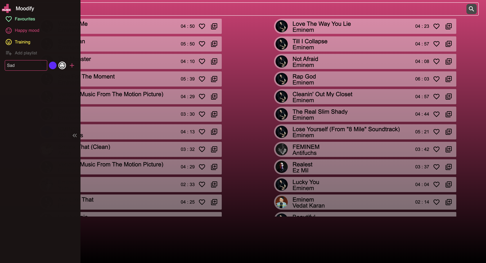
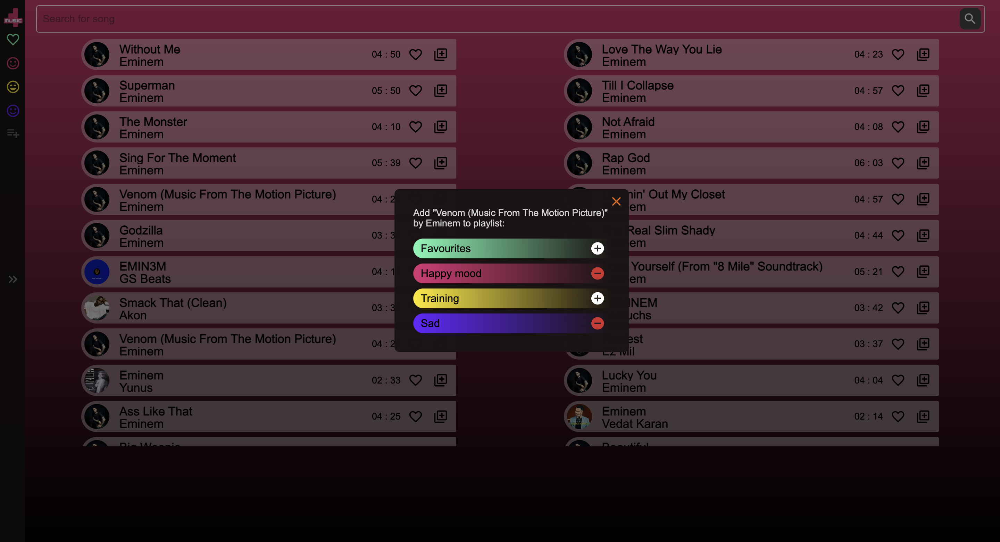
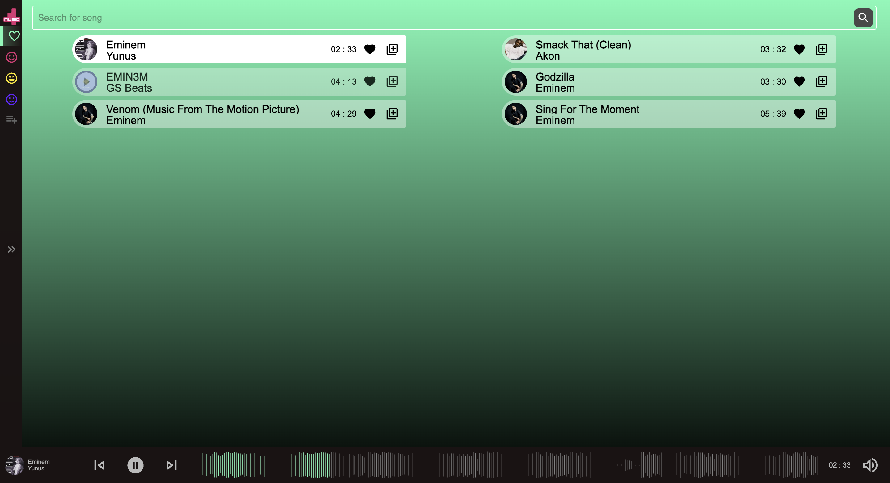

# Moodify NextJS Application

Application for selecting tracks and playlists based on mood.





## Description

This application is designed to be used as playlist editor and streaming platform. It uses Deezer Open API to get the data about tracks and uses React Context to store data about playlists and preferences.

Application is completely responsive and are usable on mobile devices too.

## Application setup

Clone project

```
git clone https://github.com/kovar95/moodify.git
```

To install all dependencies run in root folder

```
npm install
```

To run on your local machine,  simply execute from root folder:

```
npm run dev
```

It will run the application at `localhost:3000`.

Application uses:

- React
- TypeScript for typechecking
- NextJS for routing and proxying
- React Context for state management
- swr for handling requests
- MaterialUI with Styled Components for design
- wavesurfer.js for track waves
